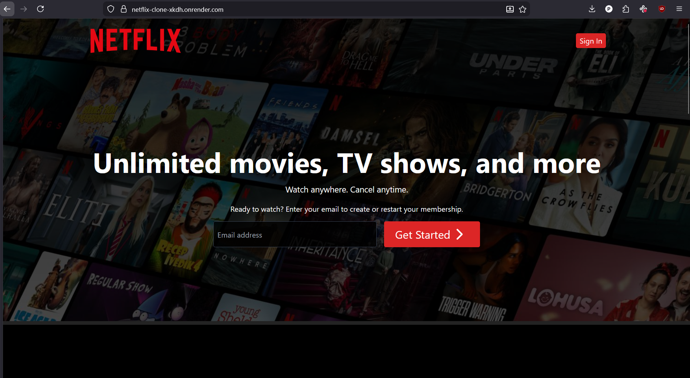
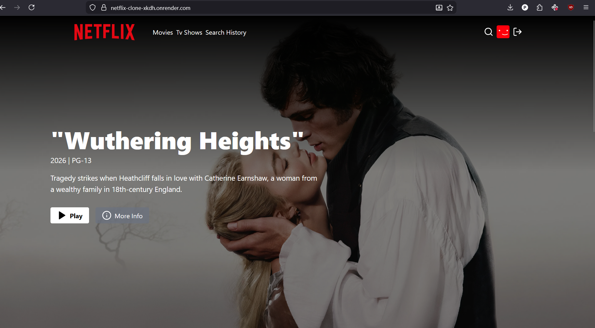

# Netflix Clone 🎬

A full-stack **Netflix-inspired streaming platform clone** built with the MERN stack (MongoDB, Express.js, React, Node.js). It replicates core Netflix features like user authentication, movie/TV browsing via TMDB API, personalized watchlists ("My List"), responsive design, and a modern dark-themed UI.

**Live Demo**: [https://netflix-clone-xkdh.onrender.com](https://netflix-clone-xkdh.onrender.com)

### 📸 Screenshots

**1. Hero Banner / Featured Movie Section**  


**2. Movie Listing / Browse Section**  


## ✨ Features

- **User Authentication**  
  Secure register/login with JWT tokens (access + refresh possible in backend)  
  Password hashing with bcrypt  
  Protected routes for user-specific data

- **Movie & TV Show Discovery**  
  Fetches trending, popular, top-rated, upcoming, and genre-based content from **TMDB API**  
  Search functionality  
  Movie/TV details pages (overview, cast, trailers, similar titles)

- **Personalized Experience**  
  "My List" – add/remove movies & shows to your personal watchlist  
  User profile with saved preferences

- **UI/UX**  
  Responsive design (mobile, tablet, desktop)  
  Netflix-style dark theme with red accents  
  Hero banner with featured content  
  Row sliders for categories (trending, action, comedy, etc.)  
  Hover effects & modals for trailers/previews

- **Backend**  
  RESTful API endpoints  
  MongoDB for user data & watchlists  
  TMDB API proxy (keeps your API key secure)

- **Other**  
  Environment variable configuration  
  Error handling & loading states  
  Clean folder structure (monorepo)

## 🛠️ Tech Stack

### Frontend (client/)
- React.js (with Hooks & Context API / Redux possible)
- React Router DOM
- Axios (for API calls)
- Styled-components / CSS-in-JS or Tailwind CSS (common in clones)
- TMDB API integration

### Backend (backend/)
- Node.js + Express.js
- MongoDB + Mongoose
- JWT for authentication
- bcryptjs for password hashing
- dotenv for environment variables
- CORS handling

### Tools & Deployment
- npm / yarn
- Render.com (current deployment)
- Git & GitHub

## 📂 Project Structure
```text
Netflix-Clone/
├── backend/                # Node.js/Express server & API
│   ├── config/             # DB connection, etc.
│   ├── controllers/        # Route logic
│   ├── models/             # Mongoose schemas (User, List, etc.)
│   ├── routes/             # API endpoints (/auth, /movies, /list, ...)
│   ├── middleware/         # auth protection
│   ├── .env                # (not committed)
│   └── server.js / index.js
├── client/                 # React frontend
│   ├── public/
│   ├── src/
│   │   ├── components/     # Reusable UI (Row, Banner, Navbar, MovieModal...)
│   │   ├── pages/          # Home, Login, Register, Profile...
│   │   ├── context/        # AuthContext, etc.
│   │   ├── services/       # API calls
│   │   ├── assets/         # images, icons
│   │   └── App.js
├── .gitignore
├── package.json            # Root-level (may manage both or separate)
└── README.md
```

## 🚀 Getting Started

### Prerequisites
- Node.js ≥ 16
- MongoDB (local or Atlas)
- TMDB API key (get free at https://www.themoviedb.org/)

### 1. Clone the repository
```bash
git clone https://github.com/JACKAS5/Netflix-Clone.git
cd Netflix-Clone
```
### 2. Install dependencies
Backend
```bash
cd backend
npm install
```
Frontend
```bash
cd ../client
npm install
```
### 3. Set up environment variables
backend/.env
```
PORT=5000
MONGO_URI=mongodb+srv://<user>:<pass>@cluster0.mongodb.net/netflix-clone?retryWrites=true&w=majority
JWT_SECRET=your_very_long_random_secret
TMDB_API_KEY=your_tmdb_api_key_here
```
### 4. Run the app
```bash
npm start
# or nodemon server.js
```
Frontend (from client/ folder)
```bash
npm start
```

#NETFLIX_CLONE
LIVE DEMO ON: https://netflix-clone-xkdh.onrender.com
